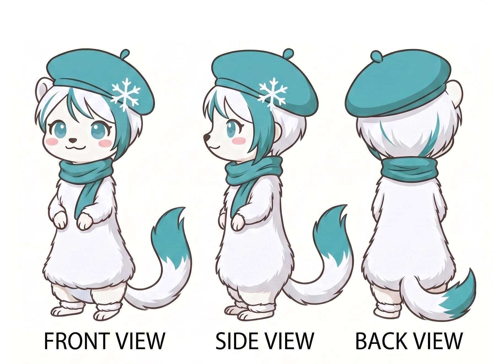
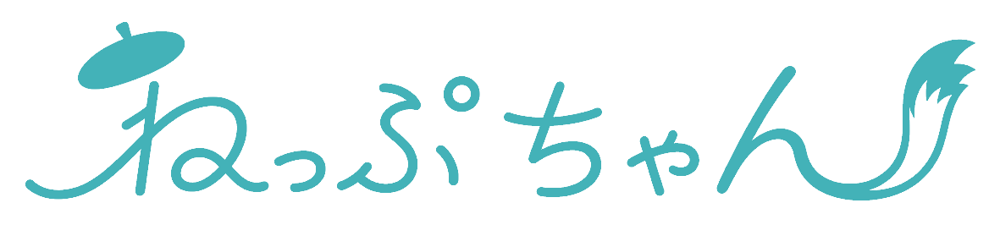
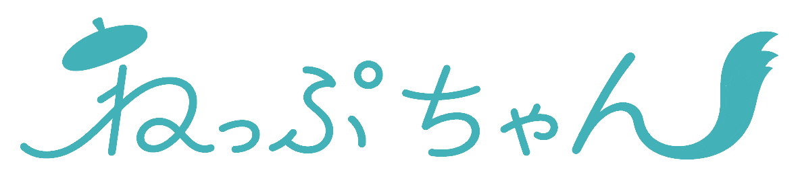
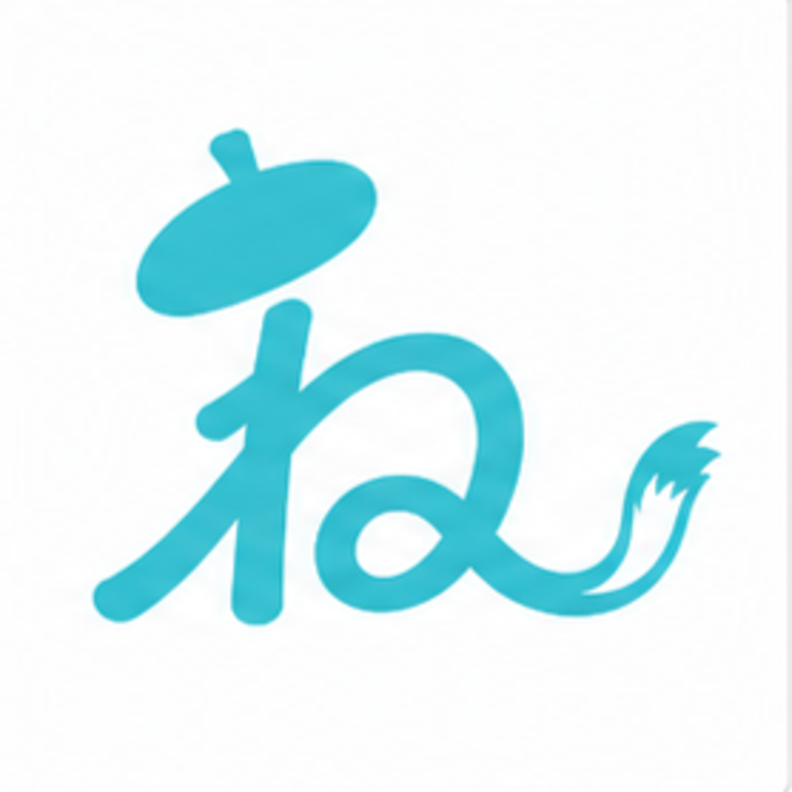

# ねっぷちゃん ビジュアルアイデンティティ

[](https://creativecommons.org/licenses/by/4.0/)

音威子府村AI副村長「ねっぷちゃん」のキャラクター・ロゴ等のビジュアルアセットです。
**[CC BY 4.0](LICENSE_CC-BY-4.0.txt)** で公開しています（コード本体は AGPLv3）。

## アセット一覧

### キャラクター（三面図）



### ロゴ

| 通常版 | 塗りつぶし版 | アイコン |
|:---:|:---:|:---:|
|  |  |  |

> アイコンはベクター版 [`logo/nepp-chan_icon.svg`](logo/nepp-chan_icon.svg) もあります。

## ライセンスと帰属表示

| 対象 | ライセンス |
|-----|----------|
| キャラクター・ロゴ等のビジュアルアセット | [CC BY 4.0](LICENSE_CC-BY-4.0.txt) |

使用時は以下の帰属表示を明記してください：

```
音威子府村AI副村長 ねっぷちゃん
nepp-chan project / 音威子府村 × KAYAC AI推進室 / CC BY 4.0
```

グッズ・二次創作・改変は自由です。特に村のみなさんに親しんでもらえたら嬉しいです。詳しくはこちらをご覧ください → **[TRADEMARK.md](TRADEMARK.md)**

## ファイル構成

```
identity/
├── character/nepp-chan_three-view.png   三面図
├── logo/
│   ├── nepp-chan_logo_ja.png            日本語ロゴ（通常）
│   ├── nepp-chan_logo_ja_fill.png       日本語ロゴ（塗りつぶし）
│   ├── nepp-chan_icon.png               アイコン
│   └── nepp-chan_icon.svg               アイコン（ベクター）
├── LICENSE_CC-BY-4.0.txt                ライセンス全文
└── TRADEMARK.md                         ブランドガイドライン
```
